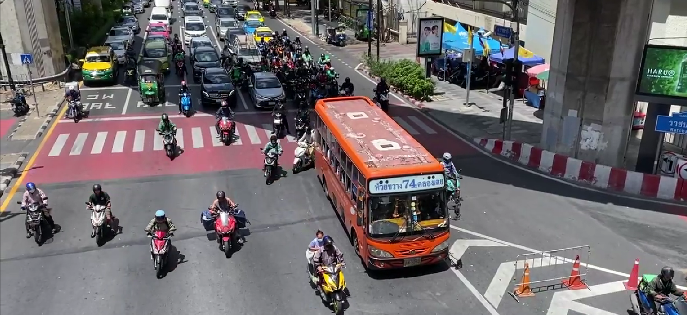
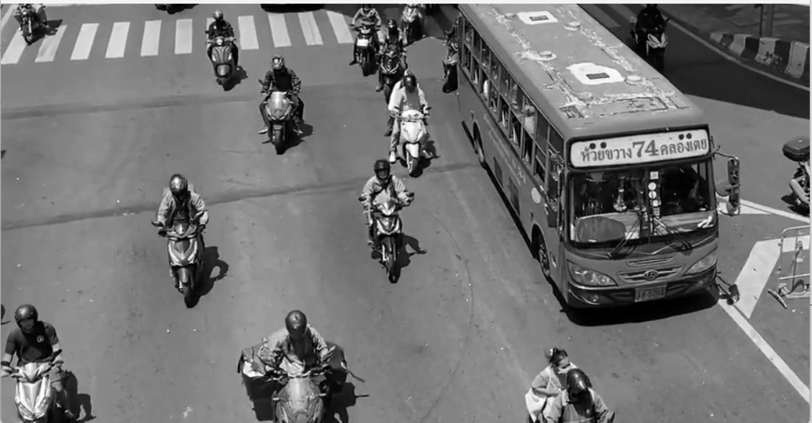
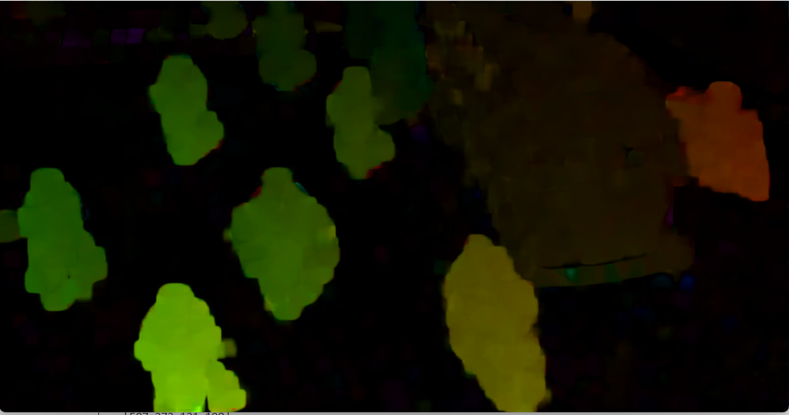
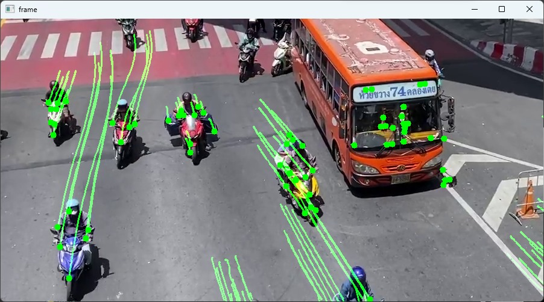
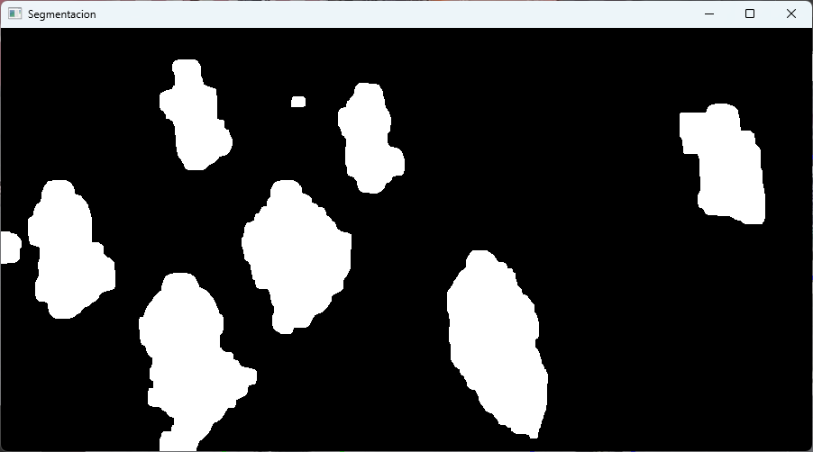
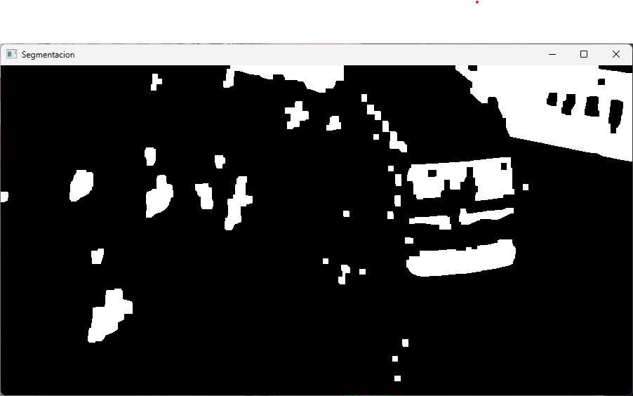
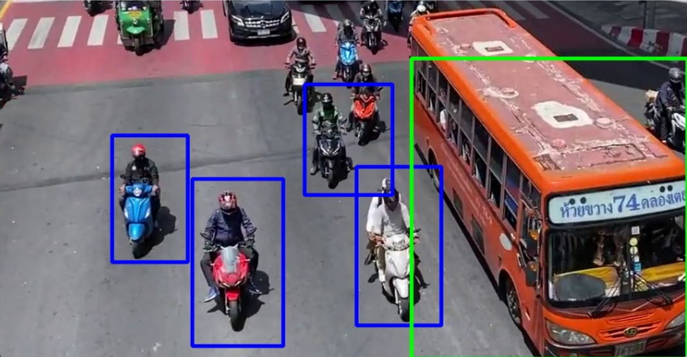
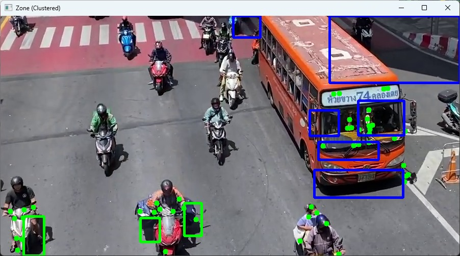

# VIISIÓN ARTIFICIAL - Proyecto Final 📸
> Desarrollar un programa que haga la estimación de movimientos, segmentar objetos y agrupar por similitud en un conjunto de datos de video.
## Métodología
### Flujo Óptico
El flujo óptico es el patrón de movimiento aparente de los objetos de la imagen entre dos fotogramas consecutivos causado por el movimiento del objeto o la cámara. Es un campo vectorial 2D donde cada vector es un vector de desplazamiento que muestra el movimiento de los puntos desde el primer fotograma hasta el segundo

El flujo óptico tiene muchas aplicaciones en áreas como:
1. Estructura de Motion
2. Compresión de vídeo
3. Estabilización de video ...

El flujo óptico funciona en varios supuestos:
1. Las intensidades de píxeles de un objeto no cambian entre fotogramas consecutivos.
2. Los píxeles vecinos tienen un movimiento similar.

#### Flujo Óptico Denso
Flujo óptico denso intenta calcular el vector de flujo óptico para cada píxel de cada fotograma. Si bien tal cálculo puede ser más lento, da un resultado más preciso y un resultado más denso adecuado para aplicaciones como la estructura de aprendizaje a partir del movimiento y la segmentación de video. Hay varias implementaciones de flujo óptico denso. Utilizaremos el método Farneback, una de las implementaciones más populares, con el uso de OpenCV, una biblioteca de código abierto de algoritmos de visión artificial, para la implementación.

#### Flujo Óptico Disperso
Flujo óptico disperso selecciona un conjunto de características dispersas de píxeles (por ejemplo, características interesantes como bordes y esquinas) para rastrear sus vectores de velocidad (movimiento). Las características extraídas se pasan en la función de flujo óptico de cuadro a cuadro para garantizar que se rastreen los mismos puntos. Hay varias implementaciones de flujo óptico escaso, incluido el método Lucas–Kanade, el método Horn–Schunck, el método Buxton–Buxton y más. Utilizaremos el método Lucas-Kanade con OpenCV.

### Detección de cambios en video
El algoritmo para detectar cambios en una secuencia
de video mediante la sustracción de imágenes consta
de cinco pasos fundamentales:

1. Guardar Imagen de Referencia: Se tomó el primer frame del video como punto de referencia, crucial para comparar los cambios en los frames subsiguientes.

2. Capturar Imagen Actual: En un bucle, se procesó cada frame del video, lo que permitió analizar el movimiento a lo largo del tiempo.

3. Realizar Sustracción de Imágenes: Se calculó la diferencia entre la imagen de referencia y cada frame, lo que resaltó las áreas de cambio o movimiento.

4. Umbralizar: Se implementó una función de umbralización manual para convertir la imagen diferenciada en una imagen binaria, facilitando así la identificación de movimientos significativos.

5. Filtrar Ruido: Se utilizaron operaciones morfológicas para refinar la imagen resultante, eliminando elementos irrelevantes y destacando los objetos en movimiento.
### Clustering K-means
El algoritmo k-medias (k-means) es un método de clustering popular que se utiliza para agrupar objetos basándose en características similares. Se evalua los clusters que se forman con la métrica, del puntaje de la silueta (silhuette score). Se ocupa el método del codo para justificar el valor de k.

## Resultados
### Video seleccionado.

En las Figuras, se muestran fotogramas del video original y la zona delimitada en escala de grises que se utilizó para realizar el procedimiento.

<table>
  <tr>
    <td align="center">
      
    </td>
    <td align="center">
      
    </td>
   
  </tr>
  <tr>
    <td align="center">
      Video original
    </td>
    <td align="center">
      Selección de zona en escala de grises.
    </td>
    
  </tr>
</table>

### Flujos ópticos 
Las Figuras presentan imágenes de fotogramas del video con los dos enfoques de flujo óptico utilizados.

<table>
  <tr>
    <td align="center">
      
    </td>
    <td align="center">
      
    </td>
    
  </tr>
  <tr>
    <td align="center">
      Flujo Óptico Denso
    </td>
    <td align="center">
      Flujo Óptico Disperso
    </td>
  </tr>
</table>

### Segmentación del vídeo

Las Figuras representan la segmentación del vídeo después de aplicar el flujo óptico.

<table>
  <tr>
    <td align="center">
      
    </td>
    <td align="center">
      
    </td>
    
  </tr>
  <tr>
    <td align="center">
      Segmentación con el flujo óptico denso
    </td>
    <td align="center">
      Segmentación con el flujo óptico disperso
    </td>
  </tr>
</table>

### Objetos resultantes

Finalmente, en las Figuras se visualizan la clusterización de los objetos en cada fotograma.

<table>
  <tr>
    <td align="center">
      
    </td>
    <td align="center">
      
    </td>
    
  </tr>
  <tr>
    <td align="center">
      Clustering con el flujo óptico denso
    </td>
    <td align="center">
      Clustering con el flujo óptico disperso
    </td>
  </tr>
</table>

## Cómo Usar el Programa

Aquí te proporcionamos instrucciones sobre cómo utilizar nuestro programa:
1. Clona este repositorio en tu máquina local.
2. Asegúrate de tener Python y las bibliotecas necesarias instaladas.
3. Ejecuta el programa cualquier archivo de .py
4. El programa aplicará el enfoque del flujo optico, la segmentación, extracción de características y la clusterizacion de objetos.

## Autores

Este proyecto fue realizado por un equipo de estudiantes:

| [ Aranza Michelle Gutierrez Jimenez](https://github.com/AranzaMich) |  [ Evelyn Solano Portillo](https://github.com/Eveeelyyyn) |  [ Marco Antonio Castelan Rosete](https://github.com/marco2220x) | [ Daniel Vega Rodríguez](https://github.com/DanVer2002) |
| :---: | :---: | :---: | :---: |
